# 카드 게임
## 프로젝트 개요
> 개발 스택 : React, node.js, postgresql  
> 개발 기간 : 2023.5.29 ~ 2023.6.17  
> 개발 목표 : drag이벤트에 사용능력 향상 및 readux/toolkit에 적응, node.js를 통해 백엔드에 대한 이해  
> 주요 기능 : 스파이더 솔리테어에 규칙을 참고해서 만든 카드 게임을 플레이하는 사이트   

## 메인화면
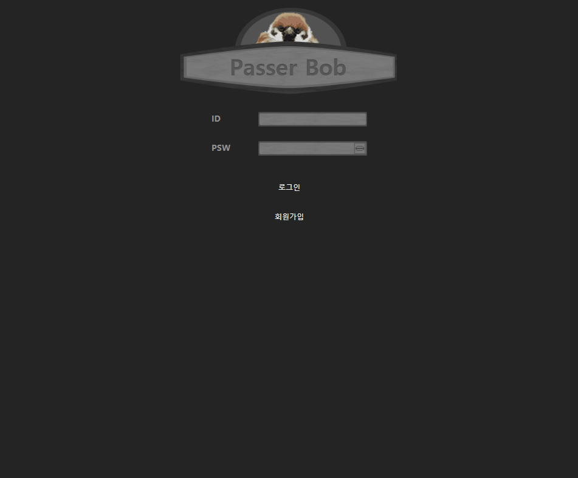 

## 화면 별 기능
### 회원가입

아이디, 비밀번호, 전화번호, 이메일, 닉네임을 입력해서 회원가입합니다. 또한 아이디는 중복 확인을 해야 되며 이미 있는 아이디일 경우 회원가입이 안됩니다.
아이디 중복 확인은 입력 칸 옆 버튼을 통해 확인합니다. 그리고 비밀번호는 2번 입력해서 불일치 할 경우 회원가입이 안됩니다.

### 로그인
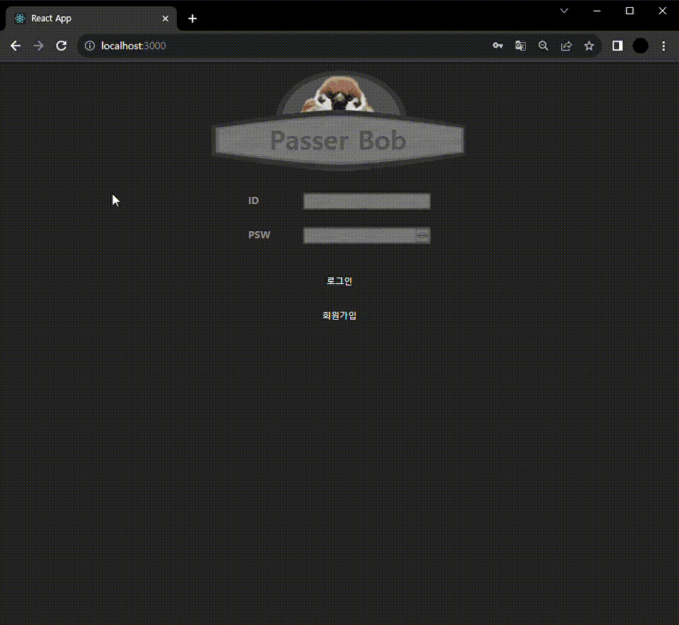 
아이디, 비밀번호를 입력해서 로그인하며, 존재하지 않는 아이디 또는 알맞지 않는 아이디, 비밀번호 일 경우 로그인이 안됩니다.

### 로비
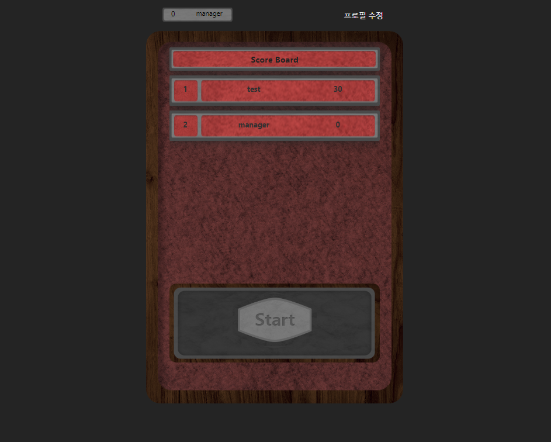 
상단부터 본인의 이름과 레벨은 상단 좌측에 나와있고, 우측에는 프로필 수정 페이지로 이동할 수 있는 링크가 있습니다. 가운데 목록은 상위 10명의 점수가 나옵니다. 그 아래는 게임 시작 버튼이 있습니다.  

### 프로필 수정
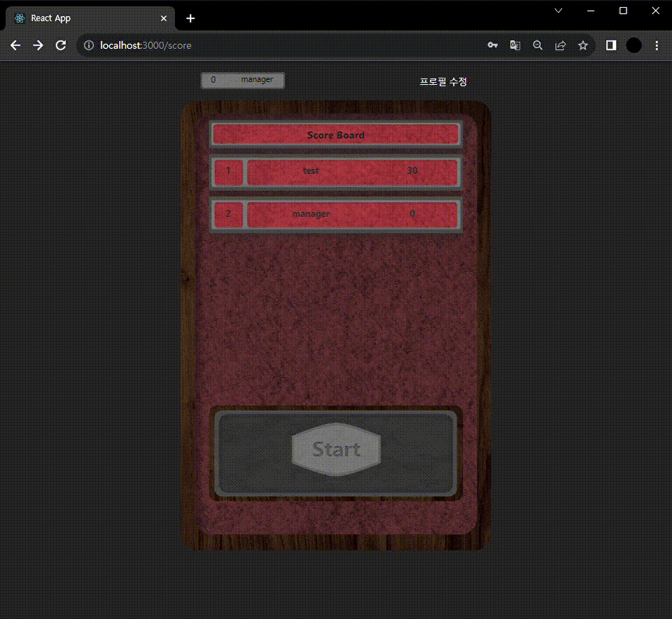 
아이디를 제외한 비밀번호, 이메일, 닉네임, 전화번호를 수정할 수 있습니다. 회원가입과 동일하게 비밀번호는 2번 입력해서 동일하지 않을 경우 수정이 불가능하며, 수정이 성공하면 로비로 이동합니다.  

### 게임화면
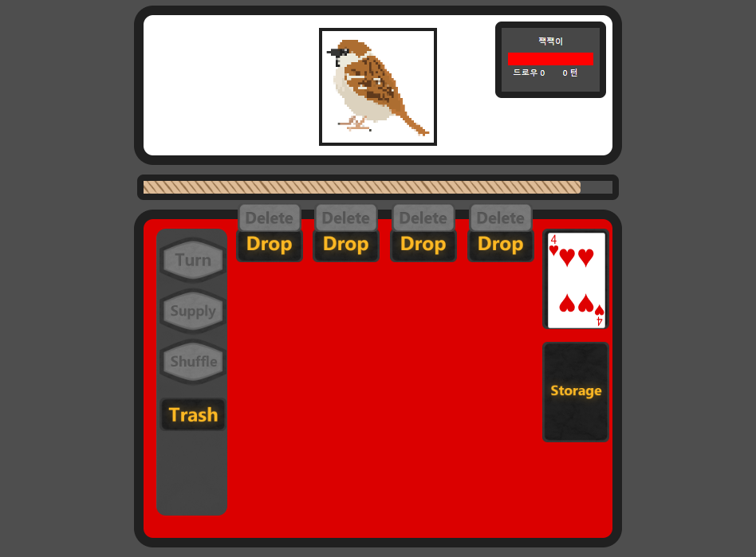  

### 카드 게임 규칙
- 카드는 한턴에 최대 5장 뽑을 수 있다.
- 카드는 각 4개의 구역에 둘 수 있으며, 마음에 들지 않는 카드 일 경우 버릴 수 있다. 카드 버리기 또한 기회 한번을 사용한다.
- 카드는 다음 규칙에 따라 둘 경우 점수를 얻을 수 있다.
  1) 모양이 같은 카드가 5장일 때 1점
  2) 12345jqk, kqj54321로 일렬이 되었을 때 2점
  3) 일렬이 되면서 모양이 같을 경우 3점
  4) A 4장과 조커 1장 일 경우 6점
- 각 카드를 두는 구역 위에 위치한 delete버튼을 누르면 해당 구역에 카드를 storage로 이동시킨다.
- deck에 카드가 없을 경우, supply버튼으로 storage에 버려진 카드를 다시 deck에 보충할 수 있다. 카드 보충은 기회를 소진하지 않는다.
- shuffle버튼은 각 구역에 있는 모든 카드를 섞는다. 이때 기회는 1회 소모된다.
- 상단 우측에 체력바가 전부 소진되면 게임이 종료합니다.
- 30턴안에 못 깨면 그 상태로 종료합니다.
  

#### 카드 드롭
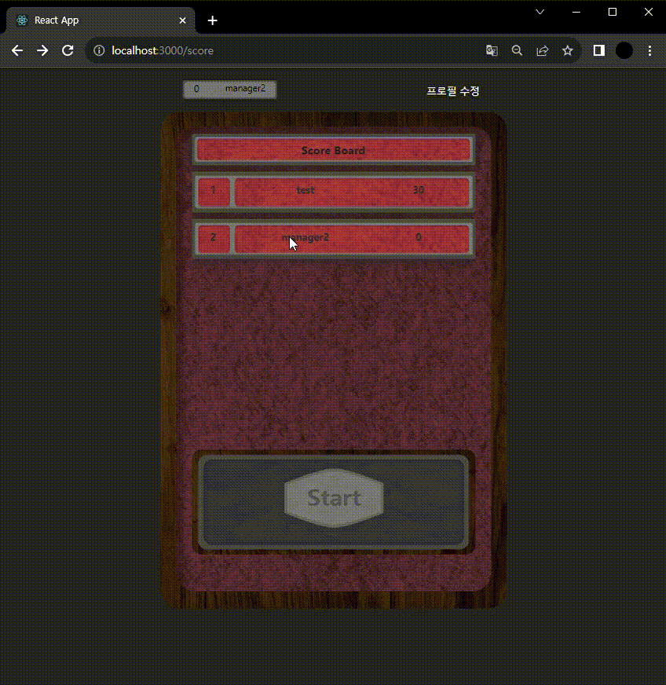 
deck에서 카드를 선택해서 drop구역에 내려놓으면 된다. 한 번 놓은 카드는 다시 드래그해서 옮길 수 없다  

#### 카드 버리기
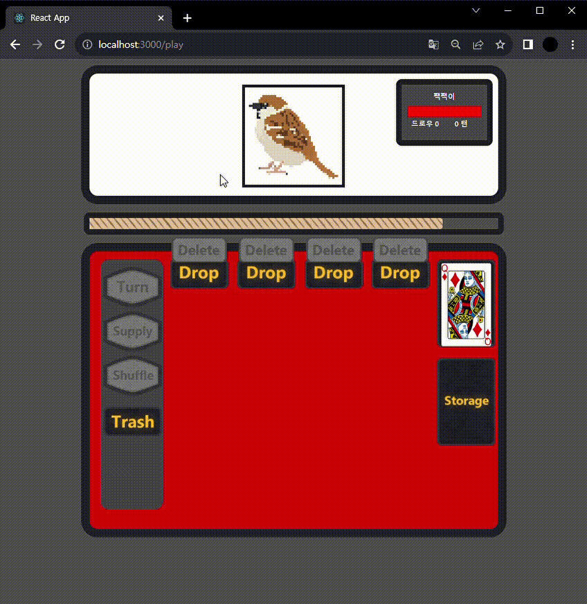 
deck에서 마음에 들지 않는 카드가 나오지 않을 경우 trash구역에 카드를 놓으면 storage구역으로 카드를 옮길 수 있다.  

#### 카드 전부 버리기
 
한 구역에 카드가 잘 못 되었을 경우 해당 구역 상단에 delete버튼을 통해 모든 카드를 버릴 수 있다.  

#### 카드 섞기
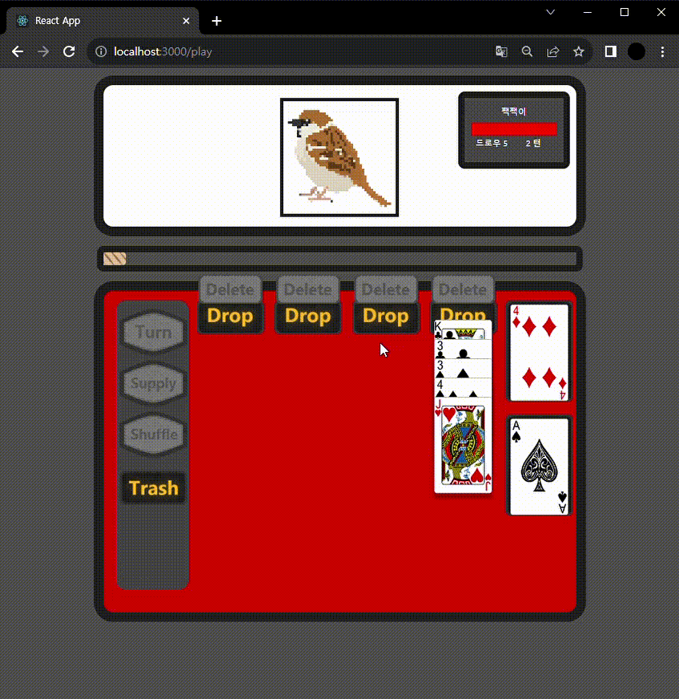 
shuffle버튼을 누르면 모든 구역을 전부 섞을 수 있습니다.  

#### 카드 보충
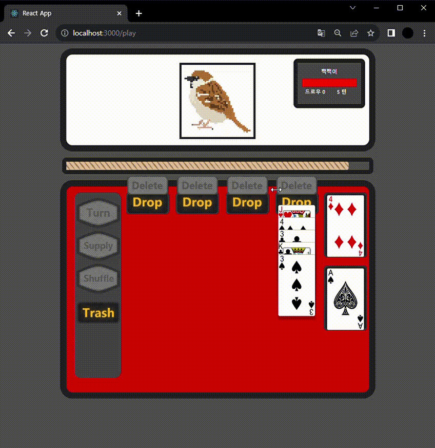 
deck에 더 이상 카드가 없거나 이전 카드가 필요할 경우 supply버튼을 통해 storage에 있는 카드를 deck으로 이동시킬 수 있습니다.  

#### 카드 공격
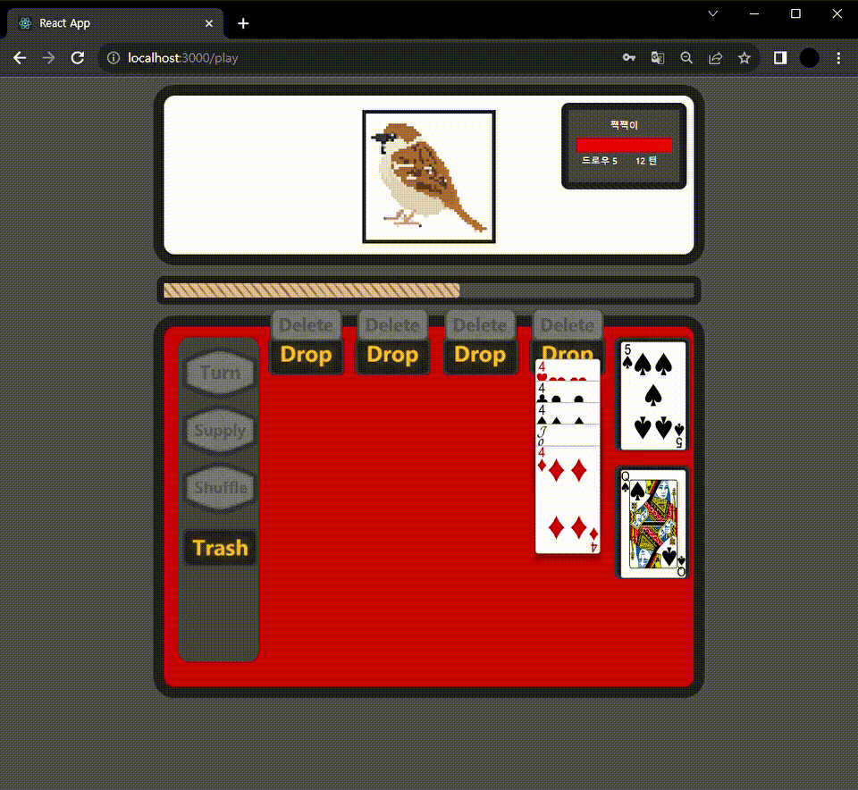 
위에서 설명한 카드게임 규칙에 나와있는 것처럼 규칙을 지킬 경우 그 규칙에 점수 만큼 체력바를 감소시킵니다. 모든 체력이 소진되면 게임은 종료 됩니다.  

#### 게임 종료
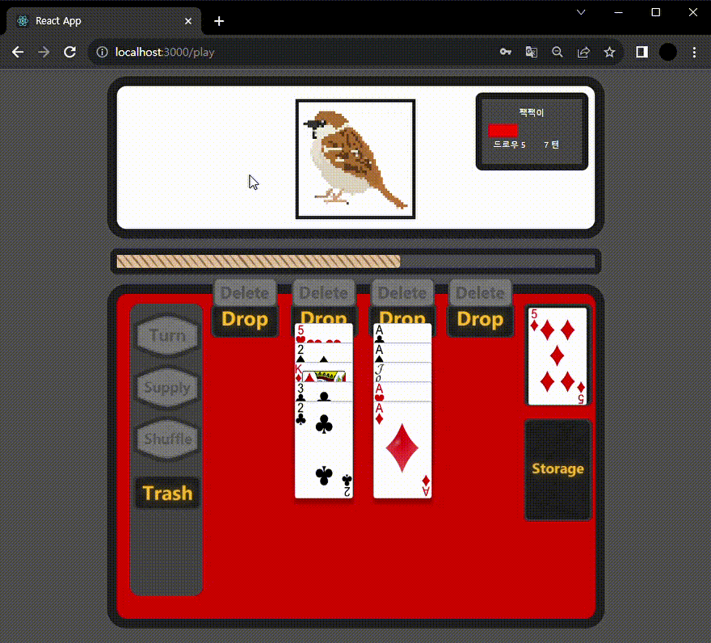 
게임이 종료되면 점수와 함께 나가기 버튼이 나옵니다. 클릭 시 로비로 이동하며 최대 점수 였을 경우 해당 점수로 바뀝니다.  
